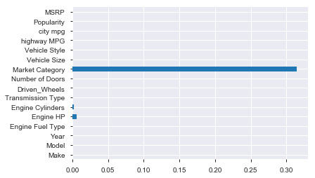
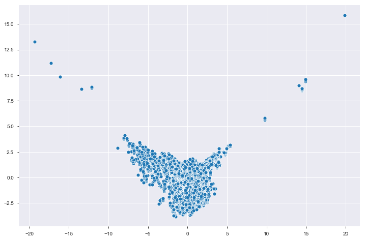

@ Puran Zhang

### Load data and extract basic information


```python
import numpy as np
import pandas as pd
import seaborn as sns
import matplotlib.pyplot as plt
from sklearn.cluster import KMeans
from sklearn.preprocessing import StandardScaler
from sklearn.decomposition import PCA
import prince
import warnings
warnings.filterwarnings("ignore")
import pandas_profiling  
```


```python
df = pd.read_csv("data.csv")
print(df.shape, '\n')
print(df.info(), "\n") # dtype of dataset
print(df.describe(), "\n") # stat of dataset
for col in df:
    print(col + ' ' + str(df[col].nunique())) # str() string version
```

    (11914, 16) 
    
    <class 'pandas.core.frame.DataFrame'>
    RangeIndex: 11914 entries, 0 to 11913
    Data columns (total 16 columns):
     #   Column             Non-Null Count  Dtype  
    ---  ------             --------------  -----  
     0   Make               11914 non-null  object 
     1   Model              11914 non-null  object 
     2   Year               11914 non-null  int64  
     3   Engine Fuel Type   11911 non-null  object 
     4   Engine HP          11845 non-null  float64
     5   Engine Cylinders   11884 non-null  float64
     6   Transmission Type  11914 non-null  object 
     7   Driven_Wheels      11914 non-null  object 
     8   Number of Doors    11908 non-null  float64
     9   Market Category    8172 non-null   object 
     10  Vehicle Size       11914 non-null  object 
     11  Vehicle Style      11914 non-null  object 
     12  highway MPG        11914 non-null  int64  
     13  city mpg           11914 non-null  int64  
     14  Popularity         11914 non-null  int64  
     15  MSRP               11914 non-null  int64  
    dtypes: float64(3), int64(5), object(8)
    memory usage: 1.5+ MB
    None 
    
                   Year    Engine HP  Engine Cylinders  Number of Doors  \
    count  11914.000000  11845.00000      11884.000000     11908.000000   
    mean    2010.384338    249.38607          5.628829         3.436093   
    std        7.579740    109.19187          1.780559         0.881315   
    min     1990.000000     55.00000          0.000000         2.000000   
    25%     2007.000000    170.00000          4.000000         2.000000   
    50%     2015.000000    227.00000          6.000000         4.000000   
    75%     2016.000000    300.00000          6.000000         4.000000   
    max     2017.000000   1001.00000         16.000000         4.000000   
    
            highway MPG      city mpg    Popularity          MSRP  
    count  11914.000000  11914.000000  11914.000000  1.191400e+04  
    mean      26.637485     19.733255   1554.911197  4.059474e+04  
    std        8.863001      8.987798   1441.855347  6.010910e+04  
    min       12.000000      7.000000      2.000000  2.000000e+03  
    25%       22.000000     16.000000    549.000000  2.100000e+04  
    50%       26.000000     18.000000   1385.000000  2.999500e+04  
    75%       30.000000     22.000000   2009.000000  4.223125e+04  
    max      354.000000    137.000000   5657.000000  2.065902e+06   
    
    Make 48
    Model 915
    Year 28
    Engine Fuel Type 10
    Engine HP 356
    Engine Cylinders 9
    Transmission Type 5
    Driven_Wheels 4
    Number of Doors 3
    Market Category 71
    Vehicle Size 3
    Vehicle Style 16
    highway MPG 59
    city mpg 69
    Popularity 48
    MSRP 6049


```python
print(df.head())
```

      Make       Model  Year             Engine Fuel Type  Engine HP  \
    0  BMW  1 Series M  2011  premium unleaded (required)      335.0   
    1  BMW    1 Series  2011  premium unleaded (required)      300.0   
    2  BMW    1 Series  2011  premium unleaded (required)      300.0   
    3  BMW    1 Series  2011  premium unleaded (required)      230.0   
    4  BMW    1 Series  2011  premium unleaded (required)      230.0   
    
       Engine Cylinders Transmission Type     Driven_Wheels  Number of Doors  \
    0               6.0            MANUAL  rear wheel drive              2.0   
    1               6.0            MANUAL  rear wheel drive              2.0   
    2               6.0            MANUAL  rear wheel drive              2.0   
    3               6.0            MANUAL  rear wheel drive              2.0   
    4               6.0            MANUAL  rear wheel drive              2.0   
    
                             Market Category Vehicle Size Vehicle Style  \
    0  Factory Tuner,Luxury,High-Performance      Compact         Coupe   
    1                     Luxury,Performance      Compact   Convertible   
    2                Luxury,High-Performance      Compact         Coupe   
    3                     Luxury,Performance      Compact         Coupe   
    4                                 Luxury      Compact   Convertible   
    
       highway MPG  city mpg  Popularity   MSRP  
    0           26        19        3916  46135  
    1           28        19        3916  40650  
    2           28        20        3916  36350  
    3           28        18        3916  29450  
    4           28        18        3916  34500  


###  Clean dataset


```python
print(df.iloc[1,7]) #row2 column7
df.iloc[0,6] = df.iloc[0, 6] + ' '
print(df.iloc[0,6])
```

    rear wheel drive
    MANUAL 


```python
print(df.groupby(['Transmission Type']).size(), '\n')
df['Transmission Type'].value_counts()
```

    Transmission Type
    AUTOMATED_MANUAL     626
    AUTOMATIC           8266
    DIRECT_DRIVE          68
    MANUAL              2934
    MANUAL                 1
    UNKNOWN               19
    dtype: int64 
    


    AUTOMATIC           8266
    MANUAL              2934
    AUTOMATED_MANUAL     626
    DIRECT_DRIVE          68
    UNKNOWN               19
    MANUAL                 1
    Name: Transmission Type, dtype: int64


```python
df = df.apply(lambda x: x.str.strip() if x.dtype=='object' else x)
# All other types map to object_ for convenience. Code should expect that such types may map to a specific (new) dtype in the future.
df['Transmission Type'].value_counts()
```


    AUTOMATIC           8266
    MANUAL              2935
    AUTOMATED_MANUAL     626
    DIRECT_DRIVE          68
    UNKNOWN               19
    Name: Transmission Type, dtype: int64


```python
print(df.isna().mean()) # True=1, get percent
df.isna().mean().plot(kind='barh') # pandas.plot kind = 'line, bar, barh, hist, box, density, pie, scatter, hexbin'
df=df.loc[:,df.isna().mean()< .3] # : ind
```

    Make                 0.000000
    Model                0.000000
    Year                 0.000000
    Engine Fuel Type     0.000252
    Engine HP            0.005792
    Engine Cylinders     0.002518
    Transmission Type    0.000000
    Driven_Wheels        0.000000
    Number of Doors      0.000504
    Market Category      0.314084
    Vehicle Size         0.000000
    Vehicle Style        0.000000
    highway MPG          0.000000
    city mpg             0.000000
    Popularity           0.000000
    MSRP                 0.000000
    dtype: float64





```python
df=df.replace('NA',np.nan) # replace symbols with np.nan
df=df.dropna() # drop rows including nan
df.info() # non-null count and dtype
```

    <class 'pandas.core.frame.DataFrame'>
    Int64Index: 11812 entries, 0 to 11913
    Data columns (total 15 columns):
     #   Column             Non-Null Count  Dtype  
    ---  ------             --------------  -----  
     0   Make               11812 non-null  object 
     1   Model              11812 non-null  object 
     2   Year               11812 non-null  int64  
     3   Engine Fuel Type   11812 non-null  object 
     4   Engine HP          11812 non-null  float64
     5   Engine Cylinders   11812 non-null  float64
     6   Transmission Type  11812 non-null  object 
     7   Driven_Wheels      11812 non-null  object 
     8   Number of Doors    11812 non-null  float64
     9   Vehicle Size       11812 non-null  object 
     10  Vehicle Style      11812 non-null  object 
     11  highway MPG        11812 non-null  int64  
     12  city mpg           11812 non-null  int64  
     13  Popularity         11812 non-null  int64  
     14  MSRP               11812 non-null  int64  
    dtypes: float64(3), int64(5), object(7)
    memory usage: 1.4+ MB


```python
print(df.duplicated().sum()) # duplicated True 1, no true
df=df.drop_duplicates() # drop rows ???
df.info()
```

    0
    <class 'pandas.core.frame.DataFrame'>
    Int64Index: 11092 entries, 0 to 11913
    Data columns (total 15 columns):
     #   Column             Non-Null Count  Dtype  
    ---  ------             --------------  -----  
     0   Make               11092 non-null  object 
     1   Model              11092 non-null  object 
     2   Year               11092 non-null  int64  
     3   Engine Fuel Type   11092 non-null  object 
     4   Engine HP          11092 non-null  float64
     5   Engine Cylinders   11092 non-null  float64
     6   Transmission Type  11092 non-null  object 
     7   Driven_Wheels      11092 non-null  object 
     8   Number of Doors    11092 non-null  float64
     9   Vehicle Size       11092 non-null  object 
     10  Vehicle Style      11092 non-null  object 
     11  highway MPG        11092 non-null  int64  
     12  city mpg           11092 non-null  int64  
     13  Popularity         11092 non-null  int64  
     14  MSRP               11092 non-null  int64  
    dtypes: float64(3), int64(5), object(7)
    memory usage: 1.4+ MB


### Visualize patterns and outliers 


```python
fig, ax=plt.subplots(figsize=(12,8)) # pyplot.subplots() return figure, axe
sns.scatterplot(x='Engine HP', y='city mpg', data=df) #seaboorn scatterplot
plt.xticks(rotation=45) # rotate xticks
```


    (array([   0.,  200.,  400.,  600.,  800., 1000., 1200.]),
     <a list of 7 Text xticklabel objects>)


```python
fig, ax=plt.subplots(figsize=(12,8))
sns.countplot(x='Transmission Type', hue='Vehicle Style', data=df, ax=ax)
# hue: optional 
plt.xticks(rotation=45)
```


    (array([0, 1, 2, 3, 4]), <a list of 5 Text xticklabel objects>)


```python
fig, ax= plt.subplots(figsize=(12,8))
sns.boxplot(x='Transmission Type', y='Engine HP', data=df)
plt.xticks(rotation=45)

```


    (array([0, 1, 2, 3, 4]), <a list of 5 Text xticklabel objects>)


```python
numeric_cols = df.select_dtypes(include=np.number).columns.tolist()
# select_dtypes tolist: return list
# sns.pairplot(df, vars=numeric_cols[:5], hue='Number of Doors', palette='Set3')
# pairwise relationship
sns.pairplot(df, vars= numeric_cols[:5],palette='Set3')
```


    <seaborn.axisgrid.PairGrid at 0x134008198>


### Find and Visualize correlations in dataset


```python
numeric_cols
```


    ['Year',
     'Engine HP',
     'Engine Cylinders',
     'Number of Doors',
     'highway MPG',
     'city mpg',
     'Popularity',
     'MSRP']


```python
df_num = df[numeric_cols]
df_corr=df_num.corr()
print(df_corr,'\n---\n')
print(df_corr.mean(), '\n---\n')
print(df_corr.abs().mean(), '\n')
```

                          Year  Engine HP  Engine Cylinders  Number of Doors  \
    Year              1.000000   0.337207         -0.026926         0.245804   
    Engine HP         0.337207   1.000000          0.788325        -0.128704   
    Engine Cylinders -0.026926   0.788325          1.000000        -0.147885   
    Number of Doors   0.245804  -0.128704         -0.147885         1.000000   
    highway MPG       0.265521  -0.423809         -0.614795         0.116846   
    city mpg          0.220037  -0.474851         -0.634509         0.137381   
    Popularity        0.086693   0.041352          0.042393        -0.059199   
    MSRP              0.209315   0.658987          0.552042        -0.145690   
    
                      highway MPG  city mpg  Popularity      MSRP  
    Year                 0.265521  0.220037    0.086693  0.209315  
    Engine HP           -0.423809 -0.474851    0.041352  0.658987  
    Engine Cylinders    -0.614795 -0.634509    0.042393  0.552042  
    Number of Doors      0.116846  0.137381   -0.059199 -0.145690  
    highway MPG          1.000000  0.842834   -0.024804 -0.207796  
    city mpg             0.842834  1.000000   -0.007093 -0.232722  
    Popularity          -0.024804 -0.007093    1.000000 -0.048438  
    MSRP                -0.207796 -0.232722   -0.048438  1.000000   
    ---
    
    Year                0.292206
    Engine HP           0.224813
    Engine Cylinders    0.119831
    Number of Doors     0.127319
    highway MPG         0.119250
    city mpg            0.106385
    Popularity          0.128863
    MSRP                0.223212
    dtype: float64 
    ---
    
    Year                0.298938
    Engine HP           0.481654
    Engine Cylinders    0.475859
    Number of Doors     0.247688
    highway MPG         0.437051
    city mpg            0.443678
    Popularity          0.163747
    MSRP                0.381874
    dtype: float64 
    


```python
fig, ax=plt.subplots(figsize=(12,8))
#sns.heatmap(df_corr, square=True, vmin=-1, vmax=1, center=0, cmap=sns.diverging_palette(20,220, n=200))
sns.heatmap(df_corr, square=True, vmin=-1, vmax=1, center=0, annot=True)
plt.xticks(rotation=45)
```


    (array([0.5, 1.5, 2.5, 3.5, 4.5, 5.5, 6.5, 7.5]),
     <a list of 8 Text xticklabel objects>)


### Cluster to indentify groups


```python
print(df_num.columns.tolist())
```

    ['Year', 'Engine HP', 'Engine Cylinders', 'Number of Doors', 'highway MPG', 'city mpg', 'Popularity', 'MSRP']


```python
x=StandardScaler().fit_transform(df_num)
kmeans=KMeans(n_clusters=5, init='random')
kmeans.fit(x)
pred=kmeans.predict(x)
np.unique(pred)
```


    array([0, 1, 2, 3, 4], dtype=int32)


```python
fig, ax=plt.subplots(figsize=(12,8))
plt.scatter(x[:,1], x[:,7],c=pred,cmap='viridis')
centers=kmeans.cluster_centers_
plt.scatter(centers[:,1],centers[:,7],c='grey',s=50)
```


    <matplotlib.collections.PathCollection at 0x1352a6d68>


### PCA


```python
pca = PCA(n_components=0.95)
pca.fit(x)
pcad = pca.transform(x)
print(pca.explained_variance_ratio_)
```

    [0.40608101 0.20002321 0.12974022 0.12532734 0.06433734 0.0398485 ]


```python
fig, ax = plt.subplots(figsize=(12,8))
sns.scatterplot(pcad[:,0], pcad[:,1])
```


    <matplotlib.axes._subplots.AxesSubplot at 0x135c89f28>





```python
pca2 = prince.PCA(n_components=6, n_iter=3, rescale_with_mean=True, rescale_with_std=True, copy=True, engine='auto')
pca2 = pca2.fit(df_num)
pca2.explained_inertia_
```


    [0.40608100803878194,
     0.20002321005538842,
     0.12974021541724326,
     0.12532734325599262,
     0.06433734168535306,
     0.039848502029732356]


```python
ax=pca2.plot_row_coordinates(df_num, ax=None, figsize=(12,8), x_component=0,y_component=1, 
                             labels=None, color_labels=df['Transmission Type'], 
                             ellipse_outline=False, ellipse_fill=True, show_points=True)
```


